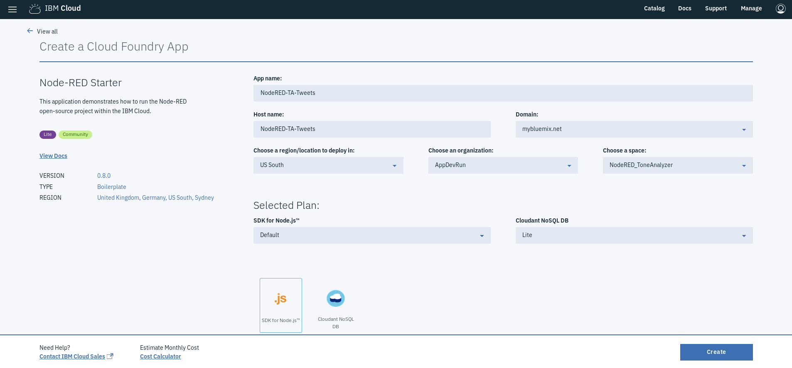
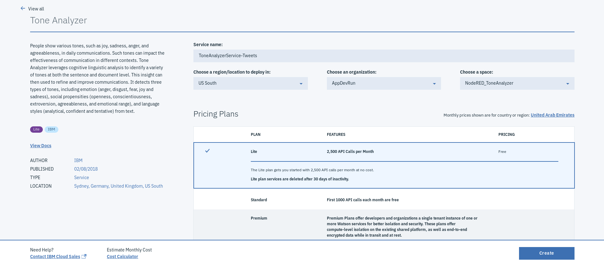
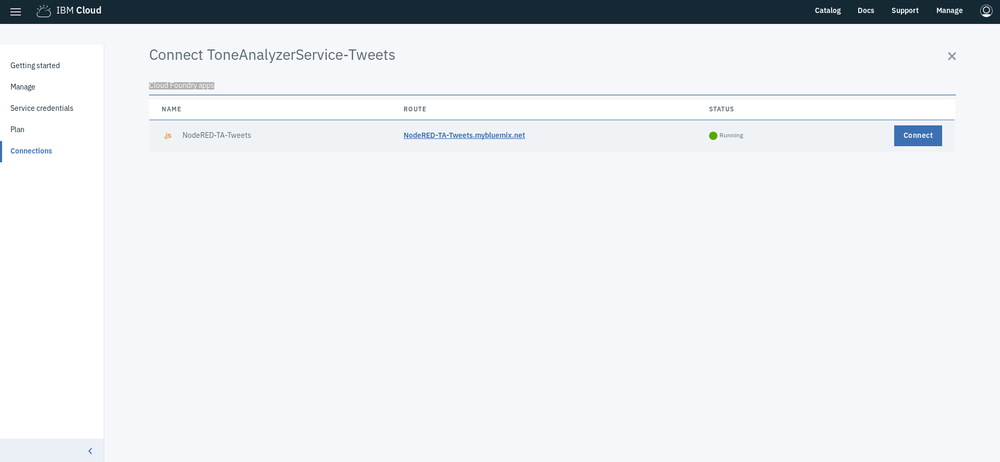
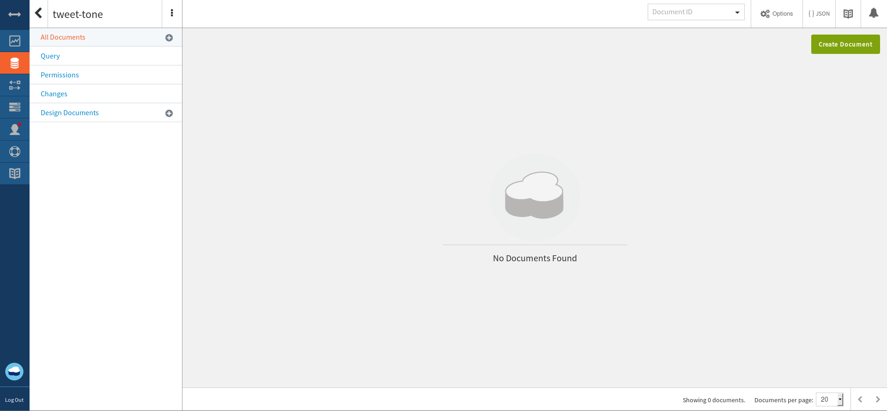
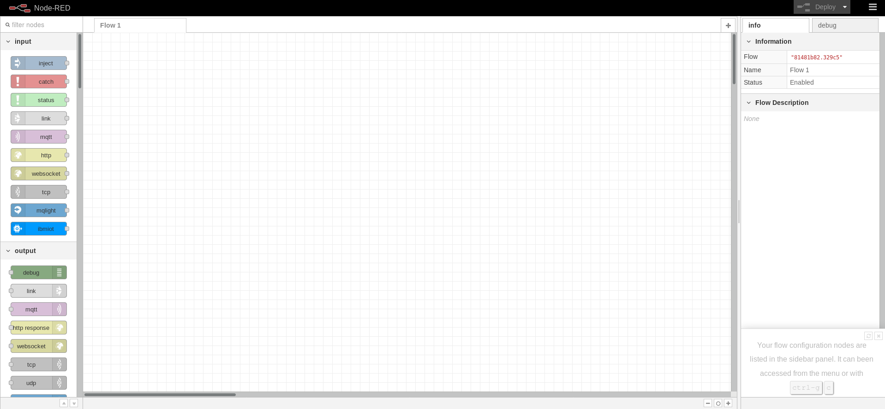

# Tone-Analyzer-Node-RED
This repository provides an example of a Node-RED application that grabs Tweets and analyzes the tone using the Watson Tone Analyzer service available on IBM Cloud. Based on the tone, the developer then posts something on Twitter. In this repository, we keep it simple by just posting one of two types of messages (based on whether the tone of the grabbed tweet is positive or negative).

You can quickly deploy the application on IBM Cloud and set up the demo by clicking on:

<a href="https://bluemix.net/deploy?repository=https://github.com/Kuroi-Yuki/Tone-Analyzer-Node-RED.git&branch=master"></a>

## Node-RED on IBM Cloud
Node-RED is an open source visual flow-based programming tool used for wiring not only Internet of Things (IoT) components, but also integrating an ensemble of service APIs, including ones provided by IBM Cloud.

## Watson Tone Analyzer service on IBM Cloud
Tone Analyzer leverages cognitive linguistic analysis to identify a variety of tones at both the sentence and document level. This insight can then used to refine and improve communications. It detects three types of tones, including emotion (anger, disgust, fear, joy and sadness), social propensities (openness, conscientiousness, extroversion, agreeableness, and emotional range), and language styles (analytical, confident and tentative) from text.

## Architecture overview
An architecture overview of the system can be found below.


## Pre-requisite
An IBM Cloud account - A lite account, which is a free of charge account that doesn’t expire, can be created through going to [IBM Cloud](http://ibm.biz/SheraaAIFeb18).

## Creating the Node-RED application
- To simplify things, a boilerplate called **Node-RED Starter** is used. It can be found by going to **Catalog** followed by selecting **Boilerplates**, which will be seen on the menu available on the left-hand side under **Platform**. 
- The user is then required to enter a unique name for the application being created, which is also used as the hostname. If the user is using a lite account, the region is set to that chosen while applying for the account. 
- After clicking on **create**, an instance of the Node-RED application (which uses Node.js to create server-side JavaScript applications) is created to which a **Cloudant NoSQL database** is bound. It will take some time for the application status to change to awake, indicating that it is running.



Next, we need to create an instance of the Watson Tone Analyzer service and bind it to the Node-RED application. 

## Creating and binding the Watson Tone Analyzer service
- Click on **Catalog** at the top of the page followed by selecting **Watson**, which will be seen on the menu available on the left-hand side under **Platform**.
- Click on **Tone Analyzer** and enter what you want to call the service (in this case, we called "*ToneAnalyzerService-Tweets*")
 - After clicking on **create**, an instance of the service will be created.



- Within the created service, go to **Connections** and click on the **connect** next to the name corresponding to the Node-Red application we just created (you will see it under **Cloud Foundry apps**.



- A window will pop up saying that **Your 'NodeRED-TA-Tweets' app needs to be restaged. Do you want to restage it now?**. Click on **restage**.

## Setting up Cloudant NoSQL database
- Go back to the **Dashboard** (can be done from the hamburger menu at the top left of the page). The **Dashboard** allows the user to see all the applications and services that have been created.
- Click on on <app-name>-cloudantNoSQLDB (in our case, it is called "*NodeRED-TA-Tweets-cloudantNoSQLDB*"). This will take us to the page with the details about the Cloudant NoSQL DB service.
- Go to **Manage** and then click on **Launch**. This will launch an interface through which we can interact with the Cloudant NoSQL DB. 
- Click on **Databases** from the menu available on the left. By default, a database called **nodered** can be found, which we are not going to touch. 
- Now, click on **Create Database** at the top of the page to create a new Database and give it a name (here, we called it "*tweet-tone*") and click **create**. Here, we will be saving any data we will be receiving/generating. Whenever we want to store something, we store that data in a document in a NoSQL database.



## Setting up the Node-RED application
- Go back to the **Dashboard** and click on the application you created earlier (we called "*NodeRED-TA-Tweets*").
- In order to access the Node-RED editor used to build the application, click on **Visit App URL**. 
- Follow the directions to access the Node-RED editor (you are encouraged to secure your Node-RED editor to ensure that only authorized users can access it). 
- Click on **Go to your Node-RED flow editor**. This should open a fresh new flow in the Node-RED flow editor called **Flow 1**.



## Overall Node-RED flow
The following diagram provides an overview of the finalize Node-RED flow. If you are not interested in starting from scratch, you can import the final version of the flow from the file **Node-RED_flow_Full.json**, which can be found in this repository.


## Building the Node-RED flow
- Start off by modifying the name current flow by double-clicking on **Flow 1** and modifying **name** (Let's change it to "*Tweet Tone Analyzer*"). This step is not compulsory but is helpful in case you are building a more complex application with multiple flows.


### 1. twitter in node
- Drag the **twitter in** or **twitter input** node, which you can find under the **social** node category (they are *modules* to be precise, but I am calling it a *category* just to make it easier to understand) on the panel on the left.
- Double-click on the node. You will find that **Add new twitter-credentials** is selected for the **Twitter ID**. You will need to click on the pencil shaped button, which will ask you to authenticate your **Twitter** account.
- Add the authenticated **Twitter** ID.
- For the search field, select **all public tweets** and the for field, type *#testmyapp*. This is to look for any tweets with this hashtag. You can also things including tweets by a specific person, direct messages you recieved or look for search terms in general.
- You are free to name this node something if you would like.
- Click **Done**.


### 2. watson-tone-analyzer-v3 node
- Drag the **tone analyzer v3** node into the flow, which you can find under the **IBM Watson** node category on the panel on the left.
- Double-click on the node.
- Name the node something by filling in the **Name** field (Not compulsory)
- Choose **General Tone** for the **Method** field (**Customer Engagement Tone** is typically selected when integrating the **Watson Tone Analyzer service** to enhance interactive chatbot applications)
- Select **Multiple Tones** for the **version_date** field as we want to look at all the different tones.
- Select **Emotion** for the **Tones** field as this is our application will only be used.
- As the tweet is most likely not going to be comprised of sentences, set **Sentences** to **False**.
- Select the **Content type** as **Text**, which is what we receive from **Twitter** and the **Input Text Language** to **English**.
- Click **Done**.


You will notice that you didn't get asked to enter any credentials, which is always required when you try ti use any of the services' API such as the **Watson Tone Analyzer** service. The reason behind that is that **Node-RED** automatically detected that you have already binded the service to the **Node-RED** application. Otherwise, it would have asked you to fill in the credential details, which you can find when you go to the **Watson Tone Analyzer** and click on **Service credentials**

### 3. function nodes
- Add the **function** node to the flow, which you can find under the **function** node category on the panel on the left.
- Double-click on the node and enter the node **Name** (in this case, we called it "*Extract emotional tone*").
- Add the code below to the **Function** field. What it basically does is look at the emotion tones from the output of the **Watson Tone Analyzer** service node, look for the top emotion as classified by **Watson Tone Analyzer** service based on which the message to be sent back to Twitter is selected. We added a timestamp to the message to ensure that Twitter does not think of a tweet as a duplicate if the same message is being posted twice due to the selected top tone.

```javascript

var emotions = [];
var threshold = 0.3;
var topemotion ='';


// Simplify the object returned by tone analyzer to only the emotion tones
emotions = msg.response.document_tone.tone_categories
                .filter(function(c){
                    if (c.category_id == "emotion_tone")
                    {return c; }
                    })[0].tones;
                    

// node.warn("Detected tones: \n" + JSON.stringify(emotions));

// Find highest score and return that tone name, if that score is greater than the threshold
topemotion = emotions.reduce(function(a, b){ return a.score > b.score ? a : b; });

if (topemotion.score > threshold) {
    topemotion = topemotion.tone_name;
} else {
    topemotion = "Neutral";
}


// Determining the msg to be returned
var emotion = "";
if(topemotion == "Neutral" || topemotion == "Joy"){
    emotion = "This tweet is positive";
    
}else{
    emotion = "Sorry to tell you that you have a negative tweet";
    
}

// Setting the final output + the timestamp 
msg.additional_context = {
    "emotions":emotion + "\n\n" + new Date(),
};


return msg;
```
- Click **Done**.


- Add another **function** node to the flow, give it a **Name** (we called it 8Pass msg into Twitter*)
- Add the code below to the **Function** field. All this code does is make sure that the message we want to pass to **Twitter** is being passed correctly through integrating it into the message payload.

```javascript
// Put the msg selected based on the emotional tone into the msg payload
msg.payload = msg.additional_context.emotions;

msg.additional_context.emotions = '';


return msg;
```
- Click **Done**.


### 4. cloudant out node
- Drag the **cloudant out** node into the flow, which you can find under the **storage** node category on the panel on the left.
- Double-click on the node.
- Name the node something by filling in the **Name** field (Not compulsory)
- As we have a **Cloudant NoSQL database** database binded to our application, the name given when we created the **Cloudant NoSQL database** earlier was automatically chosen for the **Service** field. Also, notice how no authentication was needed.
- Enter the name of the **Database** in the corresponding field (in our case, the database is called "*tweet-tone*").
- Select the **Operation** as insert as we want to store the the tweet we grab and the associated tones into the database for later analysis in the future.
- Click **Done**.


### 5. twitter out node
- Drag the **twitter out** or **twitter output** node, which you can find under the **social** noode category on the panel on the left.
- The process to be followed is same as that we followed for the **twitter in** node.
- Click **Done**.


### 6. debug node
Add the **debug** node to the flow, which you can find under the **output** node category on the panel on the left. You attach this node to display the output message content of the node it is attached to. This output will differ based on the selected message properties. You select **complete msg object** if you want to look at all the content of a message; otherwhise, you mention the part of the message you will be interested in.

### 7. comment node
- Add the **comment** node to the flow, which you can find under the **function** node category on the panel on the left.
- Double-click on the node and modify the **Title** and **Body** to describe something in the flow. 

The purpose of this node can be to explain the functionality of a series of nodes or to make it clear ro anyone who has access to the Node-RED flow what they are looking at. Though it might seem redundant here, it can be very useful in complex flows. An example can be seen below.


